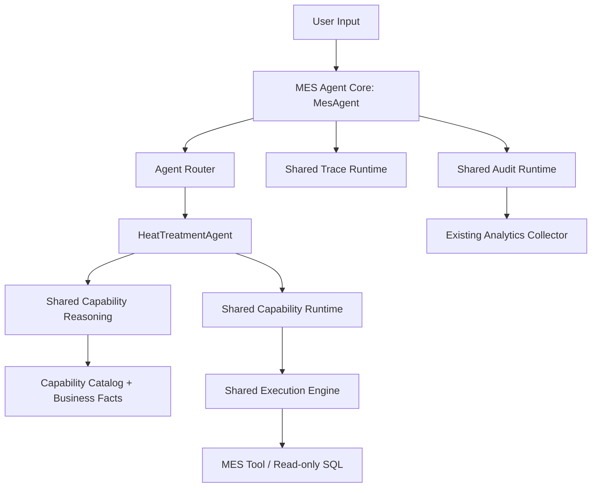

# MES Agent V2 Architecture

Date: 2026-07-10

## 1. Scope

This refactor establishes the V2 platform boundary without adding MES business capabilities. The production `/api/agent/run` chain uses `MesAgent`, a fixed `AgentRouter`, and `HeatTreatmentAgent`. Semantic Router, legacy fallback, Planner, Orchestrator, Graph, and old execution-loop code are retained under the fixed historical package and are not imported by the V2 production chain.

## 2. V1 / V2 Directory Changes

```text
backend/app/agent/
├── core/                         # V2 MesAgent and fixed AgentRouter
├── context/                      # current request and graph-free context models
├── agents/
│   └── heat_treatment/           # domain context, facts, capability ownership
├── capability/
│   ├── models/                   # capability data models
│   └── catalog/                  # definitions, loader, registry, validation
├── reasoning/
│   └── capability_reasoning/     # current reasoning boundary and algorithm
├── execution/
│   ├── engine/                   # shared executor dispatch
│   └── tools/                    # current Tool and controlled SQL execution
├── runtime/
│   ├── llm/
│   ├── trace/
│   ├── audit/
│   └── capability/
└── archive/
    ├── v1/                       # replaced V1 architecture and Graph path
    ├── experiments/              # one-off runners and evaluation scripts
    └── deprecated/               # retired package remnants retained as assets

backend/tests/
├── archive/v1/                   # historical tests and golden fixtures
└── v2/                           # current CI test suite
```

`backend/pytest.ini` sets `testpaths = tests/v2`. Historical tests remain discoverable explicitly with `pytest tests/archive/v1`; the V1 public-API contract test is retained but module-skipped because production now exposes the V2 response contract.

## 3. Production Architecture



Runtime sequence:

```text
User
-> MesAgent.run
-> AgentRouter.route (fixed HeatTreatmentAgent)
-> HeatTreatmentAgent.run
-> CapabilityReasoner.reason
-> CapabilityReasoningValidator
-> CapabilityRuntime.execute
-> ExecutionEngine.execute
-> Tool or controlled read-only SQL executor
-> TraceRuntime.finish
-> AnalyticsAuditRuntime.record
```

## 4. Dependency Rules

- `core` depends on the Domain Agent protocol and shared Trace/Audit contracts; it contains no heat-treatment rules.
- `HeatTreatmentAgent` owns domain facts, allowed heat-treatment capability names, and domain orchestration only.
- `HeatTreatmentAgent` receives Reasoning, Capability Runtime, and Trace Runtime by constructor injection. It does not create them.
- `CapabilityRuntime` validates Catalog executability and delegates to `ExecutionEngine`.
- `ExecutionEngine` knows executor implementations but does not import Domain Agents.
- Repository and MES access remain behind existing Tool/Text-to-SQL executors. No Repository or MES API logic changed.
- The V2 production packages and `app/api/agent.py` contain no historical-package import.

## 5. HeatTreatmentAgent Responsibilities

The agent owns only:

- heat-treatment Business Facts;
- the domain capability allow-list;
- domain-level prompt/reasoning context seam;
- orchestration from reasoning result to shared validation/runtime;
- clarification when a request is ambiguous, missing required entities, or targets a non-executable contract.

It does not own an LLM client, Trace/Audit implementation, Capability loader, execution engine, database access, or MES API client.

Migrated heat-treatment contracts:

| Capability | V2 state | Behavior |
| --- | --- | --- |
| `heat_current_stage` | enabled | Executes existing repository-backed Tool through shared runtime. |
| `heat_completion_count_monthly` | enabled | Executes existing controlled read-only SQL path through shared runtime. |
| `heat_device_trace` | planned | Reasoning can select the contract; validator blocks execution and returns clarification. No fake device result is produced. |

## 6. Shared Runtime List

- `LlmRuntime`: shared model invocation and structured-output boundary. V2 deterministic reasoning is retained in this round; no new model behavior was introduced.
- `CapabilityRuntime`: Catalog executability validation and capability execution gateway.
- `TraceRuntime`: records request, router, reasoning, capability, execution, and result stages.
- `AuditRuntime`: shared audit contract. Production injects `AnalyticsAuditRuntime`, backed by the existing `AgentEventCollector`.
- `ExecutionEngine`: shared executor dispatch below Capability Runtime.

## 7. Migrated Files

Moved to `backend/app/agent/archive/v1/`:

- `semantic_router/`
- `planner/`, including legacy fallback
- `orchestrator/`
- `graph.py`
- `execution_loop.py`
- `execution_observation.py`

Moved to `backend/tests/archive/v1/`:

- all former root-level backend tests;
- `fixtures/`;
- `golden/`.

Added for V2:

- `backend/app/agent/core/`
- `backend/app/agent/agents/heat_treatment/`
- `backend/app/agent/reasoning/`
- `backend/app/agent/runtime/`
- `backend/app/agent/execution/`
- `backend/app/infrastructure/agent/audit_runtime.py`
- `backend/tests/v2/`

Moved one-off V1/MVP/regression/evaluation runners into `backend/app/agent/archive/experiments/scripts/`. Their internal V1 references are relative, so no current production package imports historical code.

Current code was also physically converged:

- `core/router.py` -> `core/agent_router.py`;
- request models and Agent state -> `context/`;
- Runtime implementations -> `runtime/llm|trace|audit|capability/`;
- Capability Reasoning -> `reasoning/capability_reasoning/`;
- capability definitions and registry -> `capability/models|catalog/`;
- Tool, repository, controlled SQL, and executor dispatch -> `execution/engine|tools/`.

## 8. Verification

V2 cases cover:

1. heat-treatment current-status execution;
2. device-query contract selection with planned-capability blocking;
3. monthly completion statistics execution;
4. ambiguous-question clarification;
5. fixed Agent Router behavior;
6. `/api/agent/run` V2 dependency and response contract.

Commands and results:

```text
cd backend && .venv/bin/pytest -q
6 passed

cd backend && .venv/bin/python -m compileall -q app
passed

grep -R "archive" backend/app/agent
no matches

git diff --check
passed
```

Pyright was also run. It still reports existing typing debt in shared and V1 legacy files; V2-specific call-shape issues found during the run were corrected. This round does not expand into repository-wide typing cleanup.

## 9. Unimplemented Extension Points

- Router policies for `WorkOrderAgent` and `InspectionAgent`;
- intelligent/LLM/embedding routing;
- model-backed Capability Reasoning in the V2 production chain;
- persistent Trace Runtime beyond the current per-request trace plus Audit persistence;
- executable implementation for planned `heat_device_trace`;
- new capabilities, RAG, Memory, multi-Agent collaboration, retries, or checkpointers.

These remain explicit future seams, not partially implemented features.
